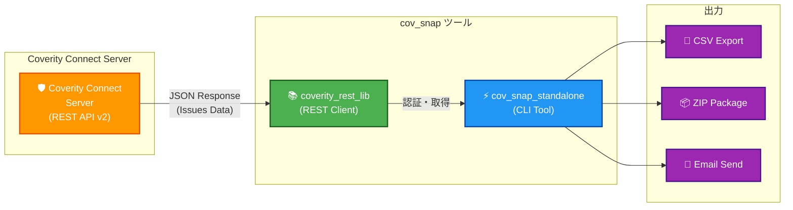

[English](README_EN.md) | **日本語**

# CovSnap


**Coverity Connect スナップショット管理ツール - REST API v2対応版**

> 🚀 SOAP API から REST API v2 への完全移行を達成！10,000件超の大量データにも対応した高速・安定なスナップショット取得ツール

## 📊 システム概要



## 概要

Coverity Connectから静的解析結果（スナップショット）を取得し、CSV形式で出力するPythonスクリプトです。

**最新情報**: 2026年1月6日にSOAP APIからREST API v2への完全移行を完了しました 🎉

## 主な機能

- ✅ **スナップショット検索**: プロジェクト/ストリーム/スナップショットIDから指摘を取得
- ✅ **CSV出力**: 指摘データをCSV形式でエクスポート
- ✅ **ページング対応**: 10,000件超のデータも自動取得
- ✅ **詳細情報取得**: ソースコード画面に表示される詳細情報を含む完全なデータ
- ✅ **REST API v2対応**: Coverity 2024.6.0以降に完全対応
- ✅ **モジュール化アーキテクチャ**: REST APIクライアントを独立したライブラリとして分離

## 🔗 出力データの活用

### COVLint - VSCode拡張機能との連携

**[COVLint](https://github.com/keides2/cov_lint)** は、CovSnapで生成したCSVファイルを利用して、Visual Studio Code上でCoverityの指摘を直接表示するLSP（Language Server Protocol）拡張機能です。

**✨ COVLintの主な機能:**
- 🎯 **ソースコード上に指摘を表示** - Coverity Connectと同様の問題箇所ハイライト
-  **CSVファイル活用** - CovSnapが生成する`snapshot_id_*.csv`を直接読み込み
- 🚀 **オフライン作業** - CSVファイルがあればCoverityサーバーへの接続不要

**📥 ダウンロード:** [COVLint - VS Marketplace](https://marketplace.visualstudio.com/items?itemName=keides2.covlint) | [GitHub](https://github.com/keides2/cov_lint)

## 📁 ファイル構成

### コアモジュール

- **`src/coverity_rest_lib.py`** (NEW! 519行)
  - Coverity Connect REST API v2クライアントライブラリ
  - `CoverityRestClient`クラス: プロジェクト/ストリーム/スナップショット/指摘情報の取得
  - ページング処理対応（10,000件超の大量データ対応）
  - 再利用可能な設計（他のツールからもインポート可能）

- **`src/cov_snap_standalone.py`** (877行)
  - スタンドアロンCLIツール
  - `coverity_rest_lib`からREST APIクライアントをインポート
  - 認定ユーザー管理、メール配信、CSV/ZIP生成

- **`src/archive/cov_snap.py`** (3,596行) - アーカイブ
  - 旧バージョンの統合モジュール（参照用として保存）
  - 新アーキテクチャ移行のため、アクティブな依存関係から除外

- **`src/cov_check_auth_user_rest.py`**
  - REST API経由での認定ユーザー認証モジュール

## クイックスタート

### 必要な環境

- Python 3.8+
- Coverity Connect認証情報（auth-key）
- 必須パッケージ: `requests`, `urllib3`

### インストール

```powershell
# リポジトリクローン
git clone https://github.com/keides2/cov_snap_pub.git
cd cov_snap_pub

# 依存パッケージインストール
pip install requests urllib3
```

### 環境変数の設定

スクリプト実行前に以下の環境変数を設定してください：

```powershell
# 必須環境変数
$env:COVAUTHUSER = "your_username"           # Coverity認証ユーザー名
$env:COVAUTHKEY = "your_auth_key"            # Coverity認証キー（32文字）
$env:COVURL = "https://coverity.example.com:8080"  # Coverity ConnectサーバーURL

# プロキシ設定（推奨）
$env:COVERITY_PROXY = "http://proxy.example.com:3128/"  # Coverity専用プロキシ

# または一般的なプロキシ環境変数
$env:HTTPS_PROXY = "http://proxy.example.com:8080"      # HTTPS通信用プロキシ
$env:HTTP_PROXY = "http://proxy.example.com:8080"       # HTTP通信用プロキシ
```

**実際の設定値について**:
- 上記の `coverity.example.com` や `proxy.example.com` は例です
- **実際のサーバーURL、プロキシURL、ネットワークパスについては、システム管理者またはセキュリティチームにお問い合わせください**
- 社内メール、チャット、または社内Wikiで案内されている場合があります

**プロキシの優先順位**:
1. `COVERITY_PROXY` - Coverity専用プロキシ（最優先）
2. `HTTPS_PROXY` - HTTPS通信用の一般的なプロキシ
3. `HTTP_PROXY` - HTTP通信用の一般的なプロキシ
4. 未設定の場合は直接接続

**注意**: 
- `COVERITY_PROXY` の使用を推奨します（タイムアウトエラー回避のため）
- プロキシ設定なしでも動作しますが、企業ネットワーク環境では接続エラーになる可能性があります

### 基本的な使い方

#### MODE 1: ローカル保存（個人実行）

認証されたユーザーが自分用にスナップショットを取得：

```powershell
# 引数: stream_name snapshot_id sender_email
python src\cov_snap_standalone.py project_stream_name 50183 user@example.com
```

- **ストリーム名**: Coverityストリーム名（例: `my_project_stream`）
- **スナップショットID**: 取得対象のID
- **送信者メール**: 認定ユーザーチェック用（アドレスファイルに含まれる必要あり）

**動作**: 
1. ストリーム名ベースのアドレスファイル (`{stream_name}_address.csv`) を読み込み
2. Coverity REST APIで認定ユーザーチェック
3. 認証OKならローカルにCSV/ZIP保存

#### MODE 2: メール配信（チーム配信）

認定ユーザー全員にメールで配信：

```powershell
# 引数: stream_name snapshot_id
python src\cov_snap_standalone.py my_project_stream 50183
```

- **To/Cc/Bcc**: アドレスファイルに基づき自動配信
- **認証**: ストリーム名ベースのアドレスファイルで認定ユーザーを管理

**動作**:
1. ストリーム名ベースのアドレスファイルから認定ユーザーを抽出
2. CSV/ZIPを生成
3. 認定ユーザー全員にメール送信

#### 後方互換性（非推奨）

⚠️ **旧形式は非推奨です**。新しい形式（ストリーム名とスナップショットIDのみ）を使用してください：

```powershell
# 旧形式: 引数が4つ以上の場合はエラーとなります
# python src\cov_snap_standalone.py group_name stream_name snapshot_id [sender_email]
# → 使用方法が表示され、エラーレベル705で終了します
```

## 🚀 最近の更新

### 2026年1月19日 - ストリーム名ベース引数に簡素化

**主な変更**:
- ✅ `group_name` 引数を削除（ストリーム名のみで動作）
- ✅ アドレスファイルをストリーム名ベースに変更 (`{stream_name}_address.csv`)
- ✅ `extract_certified_users_by_stream()` 関数を実装

**引数の変更**:
- MODE 1（旧）: `group_name stream_name snapshot_id sender_email`
- MODE 1（新）: `stream_name snapshot_id sender_email`
- MODE 2（旧）: `group_name stream_name snapshot_id`
- MODE 2（新）: `stream_name snapshot_id`

**メリット**:
- ✅ 引数が1つ減り、コマンドが簡潔に
- ✅ Outlook VBA方式と引数順が統一（後方互換性向上）
- ✅ ストリーム名だけで認定ユーザー管理が完結
- ✅ グループ名を覚える必要がなくなった

**詳細**: コミット `[今回のコミット]`

### 2026年1月15日 - 統一認証とグループ名必須化

**主な変更**:
- ✅ MODE 1/2の引数順を変更（group_nameを第1引数に）
- ✅ アドレスファイルベース統一認証を実装
- ✅ MODE 2の2引数パターンを削除（group_name必須化）
- ✅ 引数0の場合のエラー処理追加（エラーコード714）
- ✅ SOAP API非推奨化（全グループ巡回用として保持）

**引数の変更**:
- MODE 1（旧）: `stream_name snapshot_id sender_email`
- MODE 1（新）: `group_name stream_name snapshot_id sender_email`
- MODE 2（旧）: `stream_name snapshot_id [group_name]`
- MODE 2（新）: `group_name stream_name snapshot_id`

**認証の統一**:
- MODE 1/2共にアドレスファイルベース認証を使用
- `<group_name>_address.csv` で認定ユーザーを管理
- MODE 1: sender_emailが認定ユーザーかチェック
- MODE 2: 認定ユーザー全員（To/Cc/Bcc）に配信

**詳細**: コミット `65e5339`

### 2026年1月6日 - REST API v2完全移行

**主な変更**:
- ✅ SOAP API依存を100%削除
- ✅ REST API v2に完全対応
- ✅ ページング処理実装（10,000件超対応）
- ✅ 詳細情報取得機能追加（5フィールド）

**パフォーマンス向上**:
- Stage 1（基本取得）: 4-5倍高速化
- 無制限のデータ取得対応
- 予測可能な実行時間（0.28秒/CID）

**詳細**: [REST_API_MIGRATION_COMPLETE.md](docs/REST_API_MIGRATION_COMPLETE.md)

## 📁 アドレスファイル管理

### ストリーム名ベースアドレスファイル（NEW! 2026年1月）

**場所**: `\\network\share\coverity\address_stream\`

**注意**: 上記は例です。実際のネットワークパスについては、システム管理者にお問い合わせください。

**形式**: `{stream_name}_address.csv`

```csv
To,user1@example.com
Cc,user2@example.com
Bcc,user3@example.com
```

## 🛠️ トラブルシューティング

### よくある問題

**HTTP 401 Unauthorized**:
```powershell
# auth-keyファイルの確認
Test-Path "C:\cov\auth-key\auth-key.txt"
```

**接続エラー**:
```powershell
# Coverity Connectへの接続確認
Test-NetConnection coverity.example.com -Port 443
```

## 📞 サポート

- **技術ドキュメント**: `docs/` ディレクトリ
- **GitHub Issues**: 問題報告・機能要望
- **連絡先**: プロジェクト管理者

## 📄 ライセンス

MIT License

## 🤝 コントリビューション

1. Featureブランチを作成
2. 変更をコミット
3. Merge Requestを作成

---

**最終更新**: 2026年1月19日  
**バージョン**: ストリーム名ベース引数対応版（REST API v2）
